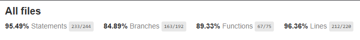

<!-- Frontend README adapted for the Inventory API frontend -->

# Inventory Frontend (React + Vite)

A small, TypeScript React frontend for the Inventory API. This app is built with Vite and provides a lightweight UI to list, create, edit and delete `Entity` records from the backend API.

## Main Features

- List, create, edit and delete entities (connected to the Inventory API)
- Dashboard cards (total items, low‑stock by type, inventory value)
- Add / Edit modals that accept prices in pt‑BR format (thousand separator + comma decimal)
- Unit tests with Vitest and e2e testing with Cypress
- Vite dev server and production preview support

## Entity Model (from API)

| Field         | Type    | Required | Notes |
|---------------|---------|----------|-------|
| `id`          | int     | auto     | Primary key |
| `type`        | string  | yes      | Entity type (e.g. "SUV", "Hatch-back") |
| `name`        | string  | no       | Descriptive name (e.g. "VW Golf") |
| `description` | string  | no       | Details (year, color, transmission) |
| `price`       | number  | no       | Unit price (frontend normalises server `unit_price`) |
| `created_at`  | string  | auto     | Timestamp |

## Prerequisites

- Node.js (18+ recommended)
- npm or yarn
- Backend API running (see the Inventory API README) and reachable via environment configuration

## Local development

1. Install dependencies

```bash
npm ci
```

2. Create a `.env` (optional) or rely on default `VITE_API_BASE_URL`.

Example `.env`:

```
VITE_API_BASE_URL=http://localhost:8000/api
```

3. Run dev server

```bash
npm run dev
```

Open http://localhost:5173

## Scripts

- `npm run dev` — start Vite dev server
- `npm run build` — build production assets into `dist/`
- `npm run preview` — locally preview production build (default port 5173)
- `npm test` — run unit tests (Vitest)
- `npx cypress open` — open Cypress GUI
- `npx cypress run --spec "cypress/e2e/**/*.cy.ts"` — run e2e tests headless

## Notes about testing & CI

- E2E tests expect the frontend to be served (dev or preview) and intercept requests to the API using wildcard patterns (e.g. `**/entities`) so tests work with proxied APIs or different hostnames.
- The repository contains a GitHub Actions workflow that runs unit tests, builds the app and runs headless Cypress in CI. The workflow pins the preview server to port `5173` and uses a `wait-on` script to ensure the server is ready.



## Price formatting

The UI formats prices using `pt-BR` rules (thousand separator `.` and decimal `,`) for display. Inputs accept numbers with `.` or `,` and are parsed to numeric values before sending to the API.

## Low-stock calculation

- Low-stock is calculated at the `type` level: the UI aggregates quantities grouped by `type` (and `name` for per-item aggregation) and marks a `type` as low when the type total is less than or equal to the configured threshold (default `5`).
- The dashboard `View All` modal lists all items belonging to the low types (grouped by type+name) and shows a per-item quantity.

## Troubleshooting

- If e2e tests time out, ensure the frontend is served at the expected port (5173) and that the backend API is reachable if not mocked.
- If TypeScript build errors appear, run `npm ci` to ensure packages are installed and check for local changes.

## Contributing

Fork, create a feature branch, add tests and open a pull request. Keep changes small and focused.

---
Created to pair with the Inventory API (Django + Django Ninja).
